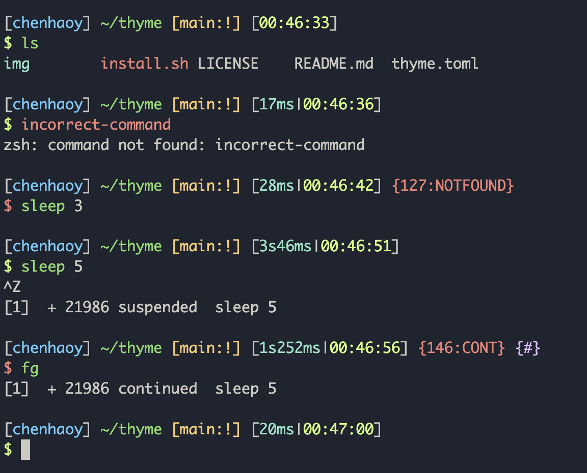

# Thyme

Thyme is a shell theme based on [Starship](https://starship.rs). Compared to an oh-my-zsh-based theme, a starship-based theme is faster and more portable.



Thyme's prompt shows:

- current time and execution time of the last command
- return value of the last command and its meaning (e.g. killed by which signal) if not zero
- job control status if there is at least one job
- git info (current branch name, dirty or not, status, etc.) if in a git repository

To install for zsh:

```shell
THYEME_SRC='https://raw.githubusercontent.com/chenhao-ye/thyme/refs/heads/main/thyme.toml'

# install starship; skip if you have starship installed already
curl -sS https://starship.rs/install.sh | sudo sh -s -- -y
# copy thyme to the starship directory and enable it
mkdir -p ~/.config/starship
curl -LsSf "$THYEME_SRC" > ~/.config/starship/thyme.toml
echo 'export STARSHIP_CONFIG="$HOME/.config/starship/thyme.toml"' >> ~/.zshrc
echo 'eval "$(starship init zsh)"' >> ~/.zshrc
```

The default thyme theme use only the left prompt. If you prefer to use right prompt for jobs/exit code/time, replace the first line `THYME_SRC` with the URL of the right-prompt one

```shell
THYEME_SRC='https://raw.githubusercontent.com/chenhao-ye/thyme/refs/heads/main/thyme_r.toml'
```
