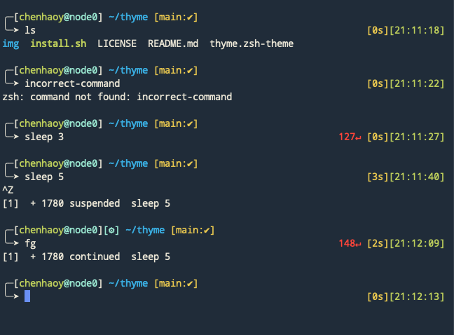

# Thyme

Thyme is a theme for zsh. It is based on [bira](https://github.com/ohmyzsh/ohmyzsh/blob/master/themes/bira.zsh-theme), [gnzh](https://github.com/ohmyzsh/ohmyzsh/blob/master/themes/gnzh.zsh-theme), and [bullet-train](https://github.com/caiogondim/bullet-train.zsh/blob/master/bullet-train.zsh-theme).



Thyme's prompt shows:

- current time and execution time of the last command
- return value of the last command if not zero
- job control status if there is at least one job
- git info (current branch name, dirty or not, status) if in a git repository

Thyme supports two options set via variables:

- if `THYME_USER_AS` is set, zsh will show `${THYME_USER_AS}` as user name.
- if `THYME_NO_HOST` is set to "true", zsh will hide host name. This can be useful on a personal computer, as the user usually know the host name very well and printing it can be redundant.
- if `THYME_NO_TIMER` is set to "true", zsh will disable timer for the process exection duration. This can have some performance benefits, but usually not a lot.
- if `THYME_NO_GIT` is set to "true", zsh will not show any git-related information. This can have some performance benefits too.
- if `THYME_NO_GIT_STAT` is set to "true", zsh will not show git status, but will still show the current branch name and whether it is dirty. Getting git status is the most time-consuming step which might hurt user experience if the filesystem is slow; this option can be viewed as an intermediate choice compared to `THYME_NO_GIT`.

To install for zsh:

```shell
./install.sh
```
